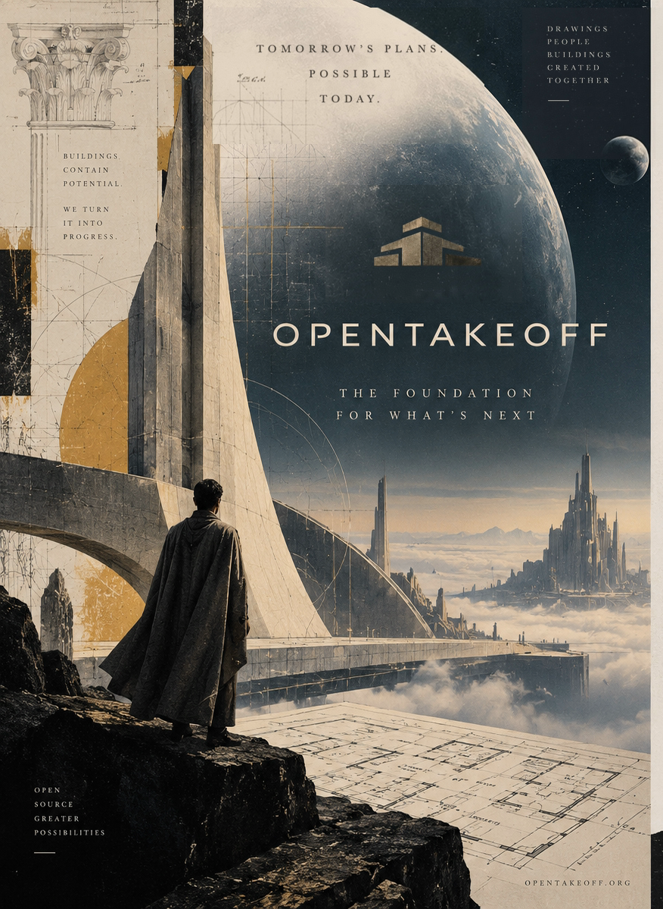
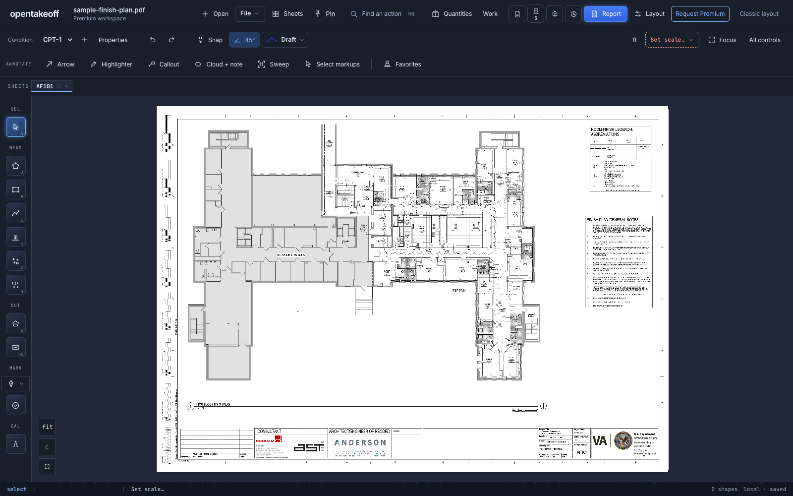

# Michael Edlin
Head of Estimating &amp; AI 
Founder, <a href="https://kentucky-ai.com">Kentucky AI</a>

<a href="https://www.linkedin.com/in/michael-edlin-695127412/">LinkedIn</a> &nbsp;·&nbsp; <a href="https://kentucky-ai.com">kentucky-ai.com</a> &nbsp;·&nbsp; <a href="https://github.com/Kentucky-ai/opentakeoff">OpenTakeoff</a>

---

I run estimating for a commercial flooring contractor and build AI tools for the work: reading plans, measuring scope, and putting bids together.

### Building

- **[OpenTakeoff](https://github.com/Kentucky-ai/opentakeoff)** — open-source (Apache-2.0) PDF takeoff for construction. Runs entirely in the browser; plans never leave your machine. The first takeoff engine an AI agent drives natively over **MCP** — one-click room detection, materials and quantities, every number traceable to geometry on the sheet. [`opentakeoff-mcp` on npm](https://www.npmjs.com/package/opentakeoff-mcp).
- **[OpenTakeoff Academy](https://github.com/Kentucky-ai/opentakeoff-academy)** — open benchmark and certification arena for construction-takeoff agents.
- **Kentucky AI** — applied-research shop for AI-native construction tooling. Wall-detection models, plan-reading pipelines, a takeoff/estimating model trained on production closeout data (patent pending).
- **Spline** — the closed-source estimating platform OpenTakeoff grew out of, in daily use on live bids.

### OpenTakeoff, on the sheet

The redesigned workspace · bundled public sample plan

See Sweep: find repeated labels and review the matches

Find a repeated label, review each match, and apply annotations to the ones you choose.

[**Try OpenTakeoff →**](https://opentakeoff.kentucky-ai.com) · [**Watch the 13-minute hotel takeoff →**](https://youtu.be/O3p4QNHSd-I)

The video shows an earlier interface: a live, uncut agent session working through a five-floor hotel from a GC scope email.

### Now

- Co-writing a research paper on AI takeoff with Alejandro Amador
- Reading Cormac McCarthy's *Blood Meridian* and westerns
- Playing futsal
- Riding motorcycles

### How I work

Rent the model, own everything underneath it — the plans, the takeoffs, the estimator's judgment, and the estimated-vs-installed scoreboard. Open source where it builds the field, closed where it's the shop's edge.

### Stack

Claude Code · Python · TypeScript/React · PostgreSQL · Docker · MCP · Vite · SegFormer/SAM2 · LoRA fine-tuning · Estimating & takeoff

---

Writing about applied AI in preconstruction on <a href="https://www.linkedin.com/in/michael-edlin-695127412/">LinkedIn</a>.

