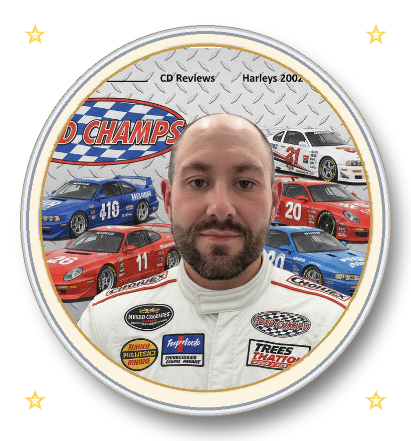

 

<table width="100%">
<tr>
<td width="300" align="center" valign="top">

</td>
<td valign="top">

### hi, i'm michael 👋

Head of Estimating + AI at a commercial flooring contractor, building the software I wish existed instead of waiting for someone else to ship it. Started in Division 9 takeoff and estimating; now I build the AI that runs the department — and the tools around it.

- 🏗️ **[OpenTakeoff](https://github.com/Kentucky-ai/opentakeoff)** — free, open-source PDF takeoff & estimating (Apache-2.0), built in the open
- 🧠 **Kentucky AI** — applied-research shop for AI-native construction tooling, [kentucky-ai.com](https://kentucky-ai.com)
- 📄 Patent-pending — an AI takeoff/estimating model trained on real closeout data, not a demo
- 🛠️ Daily stack: Claude Code, Python, TypeScript/React, Postgres, n8n — shipped fast, reviewed hard

*(that photo is not a professional headshot and that is on purpose — see below)*

</td>
</tr>
</table>

[← prev] &nbsp;•&nbsp; [random] &nbsp;•&nbsp; [next →] &nbsp;•&nbsp; <i>this webring has exactly one member, me</i>

## 🏗️ what i'm building

**[OpenTakeoff](https://github.com/Kentucky-ai/opentakeoff)** — open a plan, set the scale, trace areas with one-click room detection, add waste %, export a materials buy list. Runs entirely in your browser. Apache-2.0, agents-first (MCP server included), not a flooring freebie.

**Spline** — the AI-native takeoff platform this all grew out of. Closed-source for now, real supplier pricing and real production data running underneath it.

## 📊 stats and activity

## 🧰 stack

&nbsp;·&nbsp; best viewed at any resolution, on any browser, because it's <a href="https://github.com">github</a>, not 1999
&nbsp;·&nbsp; sign my guestbook by opening an issue

